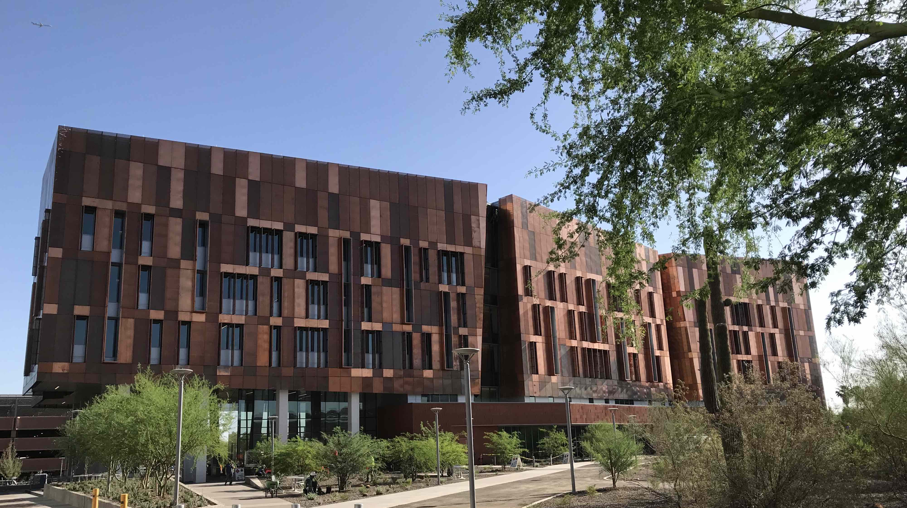

I am an Assistant Research Scientist in Mike Lynch's lab in the [Biodesign Institute](https://biodesign.asu.edu/) [Center for Mechanisms of Evolution](https://biodesign.asu.edu/research/centers/mechanisms-evolution#:~:text=The%20Biodesign%20Center%20for%20Mechanisms,the%20building%20blocks%20of%20cells.&text=In%20essence%2C%20we%20are%20aiming,field%20called%20evolutionary%20cell%20biology.).

## About my research

My work in principally focused on *cis*-regulatory regions in eukaryotic genomes, particularly promoter architecture and evolution. I am currently working on several projects in this area.

- Promoter evolution after whole-genome duplication, using the *Paramecium aurelia* species complex).
- *Cis*-regulatory sequence differences in populations, using the model system *Daphnia pulex*.
- Modeling the shape properties of promoters across eukaryotes. 

### STRIPE-seq: a novel TSS profiling method
I was also recently involved in the development of a new transcription start site (TSS) profiling method, STRIPE-seq. STRIPE-seq (Survey of TRanscription Initiation at Promoter Elements) is a straightforward and efficient method for identifying promoters from small quantities (~100ng and below) of input RNA. The STRIPE-seq preprint can be found [here](https://www.biorxiv.org/content/10.1101/2020.01.16.905182v1); at present the manuscript is in the latter stages of peer review.

### Development of bioinformatics software for analysis of TSS profiling data
To facilitate the analysis of STRIPE-seq and other forms of TSS profiling data, I have authored or contributed to bioinformatics software.
This includes TSRchitect, an R Bioconductor package that identifies and provides quantitative information on promoters using aligned TSS profiling data.
TSRchitect is available [here](https://www.bioconductor.org/packages/release/bioc/html/TSRchitect.html), and includes a vignette and user's guide.
My github page is [here](https://github.com/rtraborn).

### About the Center for Mechanisms of Evolution
The [Biodesign Institute Center for Mechanisms of Evolution](https://biodesign.asu.edu/research/centers/mechanisms-evolution#:~:text=The%20Biodesign%20Center%20for%20Mechanisms,the%20building%20blocks%20of%20cells.&text=In%20essence%2C%20we%20are%20aiming,field%20called%20evolutionary%20cell%20biology.) (CME) is focued on the specific mechanisms that govern evolutionary change, starting with the building blocks of cell. There are currently five faculty members in the CME and many more faculty associates. The CME is a part of the [Biodesign Institute](https://biodesign.asu.edu/) at Arizona State University, and is housed on the fourth floor of the new, award-winning Biodesign Institute Building C.
